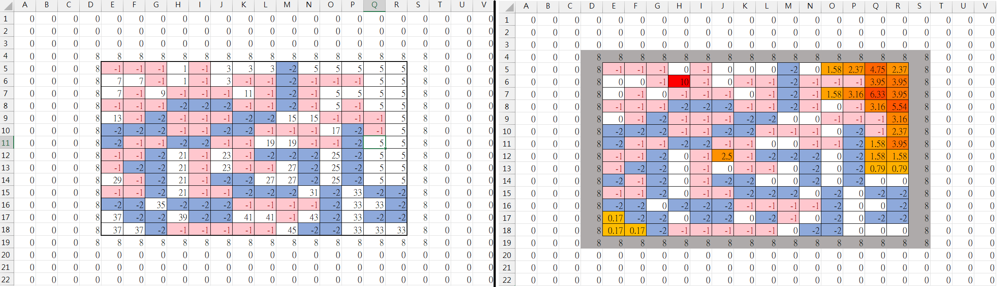
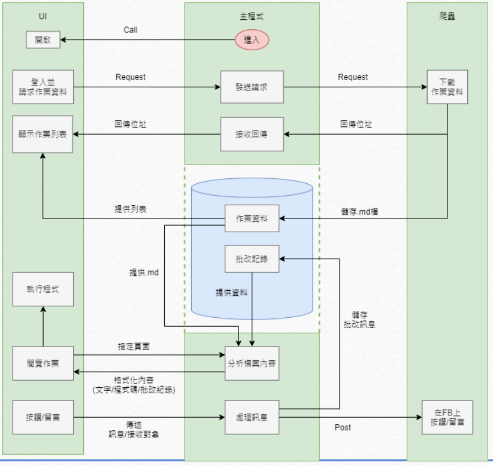
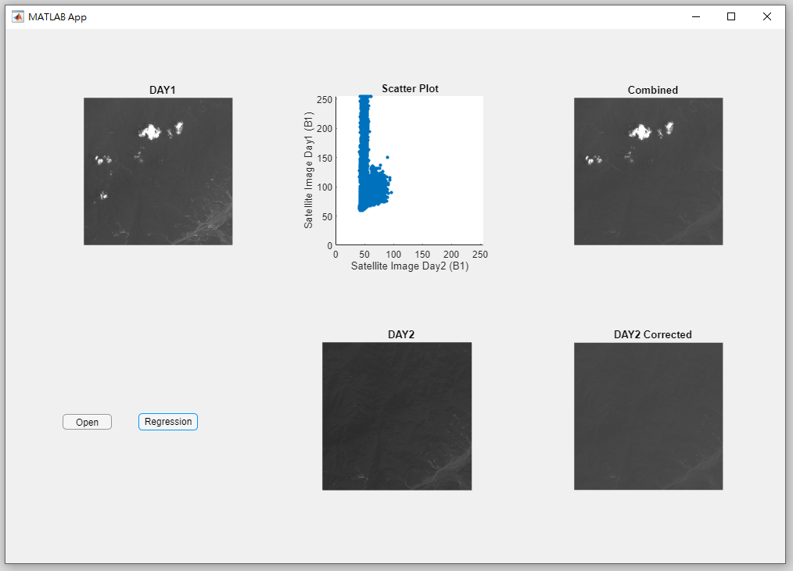
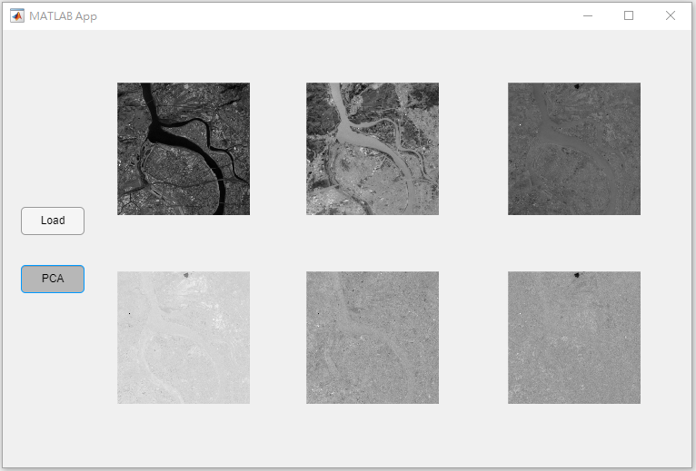
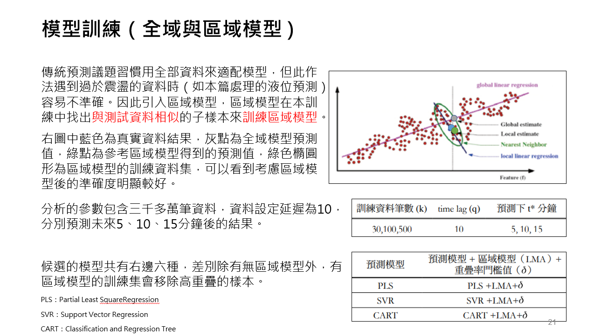
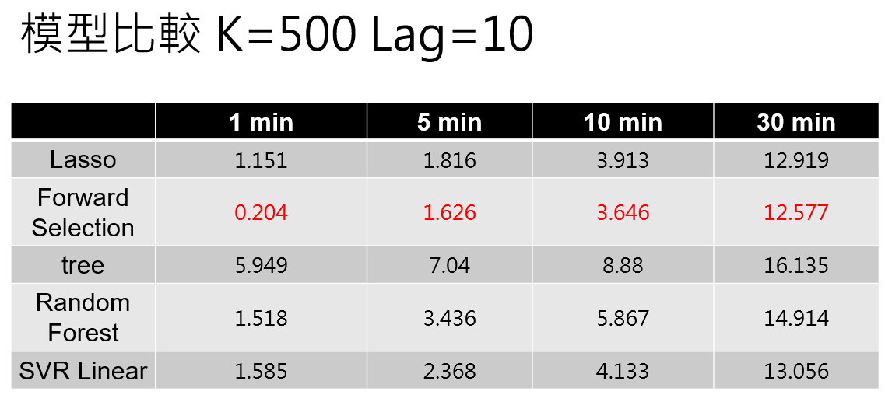
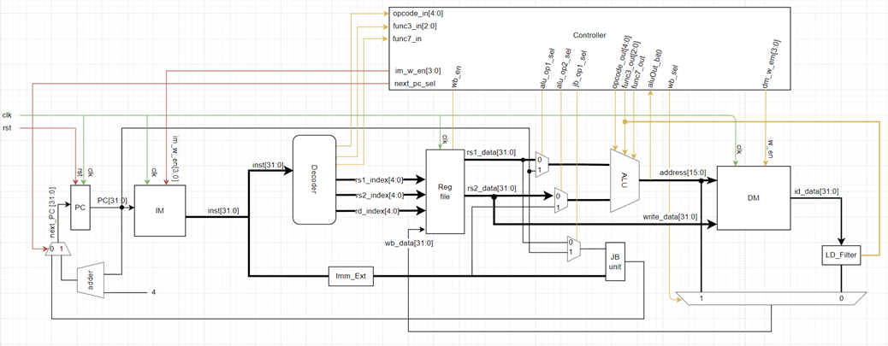

# MyColllection
這是個人的作品集，紀錄大一來的各種作品／作業

- [MyColllection](#mycolllection)
- [Overview](#overview)
  - [大一上\_計算機概論（一）](#大一上_計算機概論一)
  - [大一下\_計算機概論（二）](#大一下_計算機概論二)
  - [大二上\_運算思維與問題解決](#大二上_運算思維與問題解決)
  - [大二下\_資料結構緒論](#大二下_資料結構緒論)
  - [大三上](#大三上)
    - [程式設計](#程式設計)
    - [線性代數](#線性代數)
  - [大三下\_機器學習()](#大三下_機器學習)
  - [大四上](#大四上)
    - [計算機組織](#計算機組織)
    - [視窗程式設計](#視窗程式設計)
  - [大四下\_動態網頁程式設計](#大四下_動態網頁程式設計)

# Overview
各時期的課程與所學會的技能與成果
- 大一上_計算機概論（一）：Java、OOP觀念
- 大一下_計算機概論（二）：C、Final project嘗試設計遊戲AI
- 大二上_運算思維與問題解決：Python、網路爬蟲
- 大二下_資料結構緒論：實作部分基礎的資料結構
- 大三上
  - 程式設計：R、R在統計上的應用
  - 線性代數：Matlab語言、線性代數在影像處理上的應用
- 大三下_機器學習：熟悉機器學習方法與觀念、Final project取得比原始論文更準確的預測結果
- 大四上
  - 計算機組織：Verilog、與組員合作完成RISC-V的single cycle CPU
  - 視窗程式設計：C#、Unity、遊戲設計概念，Final project搭建離線題庫系統
- 大四下_動態網頁程式設計：網頁前端（HTML、CSS、JavaScript）、PHP、MySQL。延續視窗程式設計完成線上的題庫系統，取得8.6/10的滿意度。

## 大一上_計算機概論（一）
熟悉Java語言與OOP的概念
- 作業一 ([doc](大一上_計算機概論一\hw1\doc\document.docx))：基本java語法
- 作業二 ([doc](大一上_計算機概論一\hw2\doc\Document.docx))：咖啡廳點餐系統（熟悉flow of control）
- 作業三 ([doc](大一上_計算機概論一\hw3\doc\Document.docx))：棒球小遊戲（熟悉OOP基本觀念）
- 作業四 ([doc](大一上_計算機概論一\hw4\doc\Document.docx))：牧場物語（進階OOP觀念e.g.繼承）
- 作業五 ([doc](大一上_計算機概論一\hw5\doc\Document.docx))：牧場物語，延續作業四，實作更多複雜系統，例如天氣、存檔等
## 大一下_計算機概論（二）
熟悉C語言，並在final project中設計桌遊AI並與同學競賽
- 作業一 ([doc](大一下_計算既概論二\hw1\document.docx))：熟悉C語言語法
- 作業二 ([doc](大一下_計算既概論二\hw2\document.docx))：課表系統（熟悉pointer、array的操作）
- 作業三（Final project-1）：Blokus 桌遊AI設計，需完成基本的file IO確保程式能與TA架設的平台互動
- 作業四（Final project-2） ([doc](大一下_計算既概論二\hw4\document.docx))：Blokus 桌遊AI設計，實際發想遊戲策略，最後取得約25%的名次!
  
 
我利用excel來將棋盤視覺化幫助我思考遊戲策略，例如當前棋盤狀態的編號（左）、每格棋盤當前的收益權重（右）
## 大二上_運算思維與問題解決
熟悉Python語言與網路爬蟲
- 作業：包含各種Python語法熟悉，以及各種容器的存取方式
- Final Project([doc](大二上_運算思維與問題解決\fb_hw_helper-master\final_ppt.pdf))：助教改作業系統，設計GUI讓助教可以一站式批改同學交到臉書的作業。在這份project中我練習了如何使用Selenium與BS4做網路爬蟲。

Final Project整體程式架構圖 

## 大二下_資料結構緒論
實作部分基礎的資料結構與排序演算法
## 大三上
### 程式設計
熟悉R語言與各種統計方法在資料科學上的運用
### 線性代數
了解Matlab語言，並了解線性代數在影像處理上的運用，例如衛星影像改正、PCA截取圖片特徵等等 

利用最小平方估計減少衛星影像中的雜訊，左上與中下分別是同一地點兩天的拍攝，透過處理後可以提升清晰度。結果如右上 
 
使用PCA截取特徵向量壓縮影像大小，將左上的原圖轉換成五個band分別從中上、右上、下左....下右，可以看到每張圖所提供的資訊量越來越少 
 

## 大三下_機器學習()
利用將上學期學到的R語言，熟悉各種機器學習方法，以及feature selection, validation 等觀念。並在final project中預測煉鋼焦爐氣的液位，使用local model的觀念在長短期(5分鐘與10分鐘)預測的MAPE約1.6-4%，優於原始數據作者的2.2-5.2%，最後成為全班最高分的組別。 
[final project results](大三下_機器學習\final%20project\10(B)_機器學習專題報告.pdf) 
我們參考莊雅筑等人的論文[1]所提出的Local model來實作 
 
最後我們發現若取最相似的500個時間片段，並取前十分鐘的資料下，並且使用linaer regression + forward selection所得的效果最好，在5分鐘與10分鐘的預測優於原始論文。在30分鐘的超長時間預測亦落在可接受的12-15% 
 
[1] 莊雅筑, et al. "可解釋的 AI 系統-以焦爐氣儲槽液位預測為例." 電工通訊季刊 (2018): 69-80.

## 大四上
### 計算機組織
了解Verilog的撰寫，以及如何設計序向與組合電路，與組員合作完成RISC-V的single cycle CPU 
 

### 視窗程式設計
熟悉C#程式語言，並對於Unity引擎與遊戲設計有初步認識，Final project搭建離線題庫系統
- 課堂作業：完成如節拍器、回合對戰遊戲、密碼管理器等小型GUI程式
- Final Project：因接觸到系上必修，萌生撰寫題庫系統的念頭，以解決複習不易、英文閱讀困難等問題。

## 大四下_動態網頁程式設計
學習網頁前端（HTML、CSS、JavaScript）與PHP、MySQL。延續視窗程式設計的final project，完成線上的題庫系統，並在同學間廣泛使用，取得8.6/10的滿意度。
- 作業
  - 作業一：系網複製：熟悉HTML語法與各種element的使用
  - 作業二：系網複製二：熟悉CSS並且對作業一進行改良
  - 作業三：做出桌遊「21點」，熟悉JavaScript語法
  - 作業四：做出桌遊「21點」-2 ，使用localStorage實現遊戲存擋、讀取遊戲紀錄的功能
- Final Project：線上題庫系統
  - 視窗程式設計中做出的題庫系統為離線版，且只能於windown系統下使用
  - 希望可以使用所學的網頁技術來完成刷題系統
  - 學習如何使用GCP架設網站
  - 系統在考前有將近一半的同學使用，並且得到8.6/10的使用滿意度，累積達數千次的答題紀錄。4