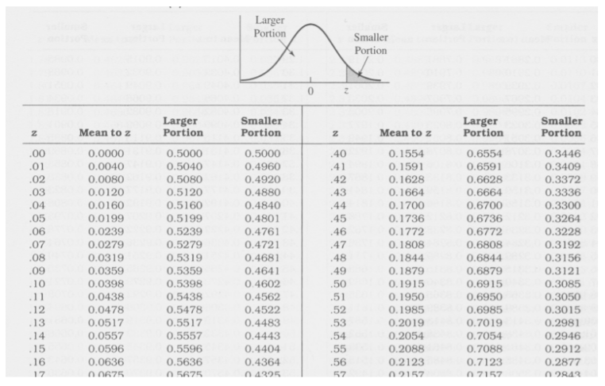

```{r setup, include=FALSE}
knitr::opts_chunk$set(echo = TRUE)
#set.seed("the last four digits of the student ID")
set.seed(6030)
source(file = "setting/setting.r")
```

# Problem 1 (20%)

Suppose that we have a matrix $X$

```{r}
X
```

  (a). Calculate the matrix $H=X(X^TX)^{-1}X^T$.  
  (b). Calculate the eigenvalues and eigenvectors of $H$.  
  (c). Calculate the trace of matrix H, and compare with the sum of the eigenvalues.    
  (d). Suppose that $A$ is a square matrix and $A=Q\Lambda Q^{-1}$, then $A^n=Q\Lambda^n Q^{-1}$. Please use this property and write a R code to calculate $H^`r my.power2022`$.   

# Problem 2 (15%)

Suppose that we have the three data frames defined as below.

```{r}
df1 <- data.frame(name = c("Mary", "Thor", "Sven", "Jane", "Ake", "Stephan", "Bjorn", "Oden", "Dennis"),
                  treatment_gr = c(rep(c(1, 2, 3), each = 3)), 
                  weight_p1 = round(runif(9, 100, 200), 0))
df2 <- data.frame(name = c("Sven", "Jane", "Ake", "Mary", "Thor", "Stephan", 
                           "Oden", "Bjorn"), 
                  weight_p2 = round(runif(8, 100, 200), 0))
df3 <- data.frame(treatment_gr = c(1, 2, 3), 
                  type = c("dog-lovers", "cat-lovers", "all-lovers"))
```

Please merge the data frames into the table which has the columns below.

> name, treatment_gr, weight_p1, type, weight_p2

Note: Your final data frame should have 9 rows and 5 columns.

# Problem 3 (15%)  

Please write a R code to generate the Z table below. 

<center>{width=60%}</center>

# Problem 4   

(a) Please use `t.test()` (two sample t-test) to test whether the means of HP between the non-legendary Pokemon and legendary Pokemon are equal or not. (15%) 

```{r}
dt <- read.csv("pokemon.csv", header = T)
head(dt)
```

(b) Please write a R code to calculate all information in (a). (20%)    

# Problem 5  

(a) Use three `apply` family functions to get the `r paste(my.apply)` values of each column of the `mtcars` dataset. (10%)
(b) The function `MyCheck` that can check if a value is above a threshold value. The function `MyCheck` have two parameters: `x` which is the numeric value to check, and `threshold` which is the numeric threshold.  

```{r}
MyCheck <- function(x, threshold=50) x > threshold
```

According to the function `MyCheck`, write a function that can use to count the values in a vector that above a given threshold value. (5%)

(c) Use the function in (b) and the `tapply` function to find out how many Pokemon had an HP value above `r my.PH` for each type of `Type.1` in the `Pokemon` dataset. (10%) 