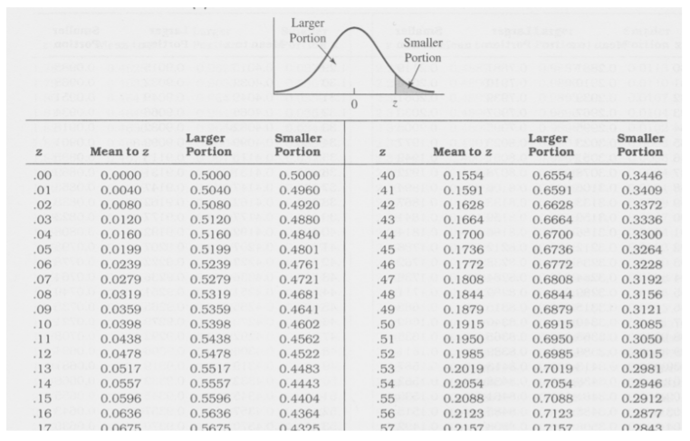

```{r setup, include=FALSE}
knitr::opts_chunk$set(echo = TRUE)
#set.seed("the last four digits of the student ID")
set.seed(6030)
source(file = "setting/setting.r")
```

# Problem 1 (20%)

Suppose that we have a matrix $X$

```{r}
X<-matrix(c(  1,1,1,1,1,-.56,-.43,-.62,.57,-1.48),ncol=2)
X
```

  (a). Calculate the matrix $H=X(X^TX)^{-1}X^T$. 
  
```{r}
# Ans
H=X%*%solve(t(X)%*%X)%*%t(X)
H
```

  (b). Calculate the eigenvalues and eigenvectors of $H$.  
  
```{r}
# Ans
E<-eigen(H)
print("eigenvalue")
E$values
print("eigenvector")
E$vectors
```

  (c). Calculate the trace of matrix H, and compare with the sum of the eigenvalues.    
  
```{r}
# Ans
sum(E$values)
sum(diag(H))
# both equal 2
```
  
  (d). Suppose that $A$ is a square matrix and $A=Q\Lambda Q^{-1}$, then $A^n=Q\Lambda^n Q^{-1}$. Please use this property and write a R code to calculate $H^`r my.power2022`$.   

```{r}
# Ans
E$vectors%*%diag(E$values)^8%*%solve(E$vectors)
```


# Problem 2 (15%)

Suppose that we have the three data frames defined as below.

```{r}
df1 <- data.frame(name = c("Mary", "Thor", "Sven", "Jane", "Ake", "Stephan", "Bjorn", "Oden", "Dennis"),
                  treatment_gr = c(rep(c(1, 2, 3), each = 3)), 
                  weight_p1 = round(runif(9, 100, 200), 0))
df2 <- data.frame(name = c("Sven", "Jane", "Ake", "Mary", "Thor", "Stephan", 
                           "Oden", "Bjorn"), 
                  weight_p2 = round(runif(8, 100, 200), 0))
df3 <- data.frame(treatment_gr = c(1, 2, 3), 
                  type = c("dog-lovers", "cat-lovers", "all-lovers"))

```

Please merge the data frames into the table which has the columns below.

> name, treatment_gr, weight_p1, type, weight_p2

```{r}
# Ans
df4<-merge(x=df1,y=df2,by="name",all = TRUE)
df5<-merge(x=df4,y=df3,by="treatment_gr")
df5[1:5]<-c(df5$name,df5$treatment_gr,df5$weight_p1,df5$type,df5$weight_p2)
colnames(df5)<-c("name", "treatment_gr", "weight_p1", "type", "weight_p2")
df6<-df5[order(df5[,1]),]
rownames(df6)<-1:9
df6
```

Note: Your final data frame should have 9 rows and 5 columns.

# Problem 3 (15%)  

Please write a R code to generate the Z table below. 

<center>{width=60%}</center>

```{r}
# Ans
ztable <- matrix(NA, nrow = 18, ncol = 8)
colnames(ztable)<-c("x","Mean to x","Larger protion","Smaller Portion","x","Mean to x","Larger protion","Smaller Portion")

for (i in 1:18) {
  ztable[i, 1]<-0.01*(i-1)
  ztable[i, 2] <- round(pnorm( q = 0.01*(i-1), mean = 0, sd = 1),4)-.5
  ztable[i, 3] <- round(pnorm( q = 0.01*(i-1), mean = 0, sd = 1),4)
  ztable[i, 4] <- 1- ztable[i, 3]
}
i=41
for (i in 41:58) {
  ztable[i-40, 5]<-0.01*(i-1)
  ztable[i-40, 6] <- round(pnorm( q = 0.01*(i-1), mean = 0, sd = 1),4)-.5
  ztable[i-40, 7] <- round(pnorm( q = 0.01*(i-1), mean = 0, sd = 1),4)
  ztable[i-40, 8] <- 1- ztable[i-40, 7]
}

ztable
```

# Problem 4   

(a) Please use `t.test()` (two sample t-test) to test whether the means of HP between the non-legendary Pokemon and legendary Pokemon are equal or not. (15%) 

```{r}
# Ans
pokemon<-read.csv("pokemon.csv")
isleg<-subset(x=pokemon,subset = Legendary==TRUE)
notleg<-subset(x=pokemon,subset = Legendary==FALSE)
t.test(isleg$HP,notleg$HP)
#because pvalue <0.05, the HP between the non-legendary Pokemon and legendary Pokemon are not equal
```

(b) Please write a R code to calculate all information in (a). (20%)    

```{r}
# Ans
print("mean of x")
mean(isleg$HP)
print("mean of y ")
mean(notleg$HP)
```

# Problem 5  

(a) Use three `apply` family functions to get the `r paste(my.apply)` values of each column of the `mtcars` dataset. (10%)

```{r}
# Ans
data<-mtcars
data
apply(X=data,2,FUN=max)
lapply(X=data,2,FUN=max)
sapply(X=data,2,FUN=max)
```

(b) The function `MyCheck` that can check if a value is above a threshold value. The function `MyCheck` have two parameters: `x` which is the numeric value to check, and `threshold` which is the numeric threshold.  

```{r}
MyCheck <- function(x, threshold=50) x > threshold
```

According to the function `MyCheck`, write a function that can use to count the values in a vector that above a given threshold value. (5%)

```{r}
# Ans
MyCheck <- function(x, threshold=50) x > threshold
Mythreshold<-function(data,threshold){
  #temp<-apply(X=data,MARGIN = 2,FUN=function(x) MyCheck(x,threshold))
  result<-sum(MyCheck(data,threshold))
  return(result)
}
Mythreshold(data$mpg,50)
```

(c) Use the function in (b) and the `tapply` function to find out how many Pokemon had an HP value above `r my.PH` for each type of `Type.1` in the `Pokemon` dataset. (10%)

```{r}
# Ans
pokemon<-read.csv("pokemon.csv")
tapply(X = pokemon$HP, INDEX = pokemon$Type.1, FUN = function(x) Mythreshold(x,30))
```
