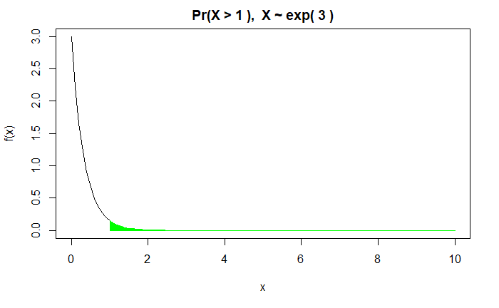
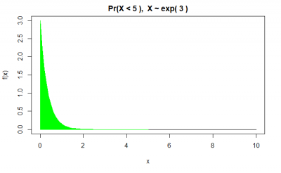

```{r setup, include=FALSE}
knitr::opts_chunk$set(echo = TRUE)
#set.seed("the last four digits of the student ID")
set.seed(6030)
my.x2021 <- round( runif(2), 2)
my.n2021 <- sort(sample(c(50, 100, 200, 500), 2))
my.lambda2021 <- round( rpois(1, lambda = 1.5), 2)
my.p2021 <- round(runif(1), 2)
my.r <- sample(1:10, 1)
my.alpha <- round(rgamma(1,1,1), 2)
my.beta <- round(rgamma(1,1,1), 2)
```

# Problem 0 (30%)

(a). Write a R program to get all prime numbers up to a given number (based on the sieve of Eratosthenes).  
(b). Write a R program to print the numbers from 1 to 100 and print “Fizz” for multiples of 3, print “Buzz” for multiples of 5, and print “FizzBuzz” for multiples of both.  
(c). Write a R program to create three vectors a,b,c with 3 integers. Combine the three vectors to become a 3×3 matrix where each column represents a vector. Print the content of the matrix.  
(d). Write a R program to compute sum, mean and product of a given vector elements.  
(e). Write a R program to create two 2x3 matrix and add, subtract, multiply and divide the matrices.  

```{r}
# (a)
# (b)
# (c)
# (d)
# (e)
```


# Problem 1 (10%)

Calculate the sum $\sum_{k=1}^n x^k/k$, and compare with $-ln(1-x)$, for $x=`r my.x2021[1]`, `r my.x2021[2]`$ and $n=`r my.n2021[1]`, `r my.n2021[2]`$.

```{r}
# 
```


# Problem 2 (10%)

Let $f_n$ denote the $n$th Fibonacci number.  

   (a). Construct a sequence of ratios of the form $f_n/f_{n-1}$, $n=1,...,30$. Does the sequence appear to be converging?  
   (b). Compute the golden ratio $(1+\sqrt{5})/2$. Is the sequence converging to the ratio? Please draw a graph to support your answer.  

```{r}
#(a)
```


```{r}
#(b)
```

 
# Problem 3

(a). Let $X$ be a Poisson random variable with mean $\lambda=`r my.lambda2021`$. Calculate the mean and variance of $X$ using `while` loop. (8%)  
(b) Let $Y$ be a geometric random variable with parameter $p$. The probability mass function of $Y is
$$Pr\{Y=y\}=(1-p)^{x-1}p,x=1,2,...,0<p<1$$
Use `repeat` loop to calculate the mean of $Y$ with $p=`r my.p2021`$. (7%)

```{r}
#(a)
```


```{r}
#(b)
```


# Problem 4

(a). Use a fixed-point iteration to find a root of $cox(x)-xe^x=0$. How many iteration does it take before you have an answer which is accurate in the first two digits?  (5%)  
(b). Use Newton's method to find a root of $cox(x)-xe^x=0$. How many iteration does it take before you have an answer which is accurate in the first two digits? (10%)  

```{r}
#(a)
```


```{r}
#(b)
```


# Problem 5

Write a function that can fill the area under curve (the Exponential distribution with rate $\lambda=`r my.lambda2021`$) for a given value $x > 0$ on the x-axis. The probability density function is 
$$f(x)=\lambda e^{-\lambda x}, x>0$$
The user can specify the following options: (a) upper-tail or lower-tail  (b) the value on the x-axis. (20%)

```{r, eval=FALSE}
Myplot(location = 1, upper = TRUE)
Myplot(location = 5, upper = FALSE)
```




# Problem 6  

Suppose that we have a function
$$f(x)=\frac{1}{\sqrt{2\pi}}e^{-\frac{(x-\mu)^2}{2}}, -\infty < x < \infty.$$
Please find the maximum of the function above using fixed-point iteration or Newton's method. (15%)
